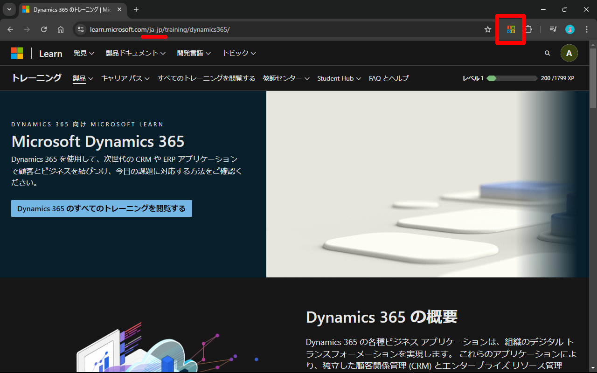
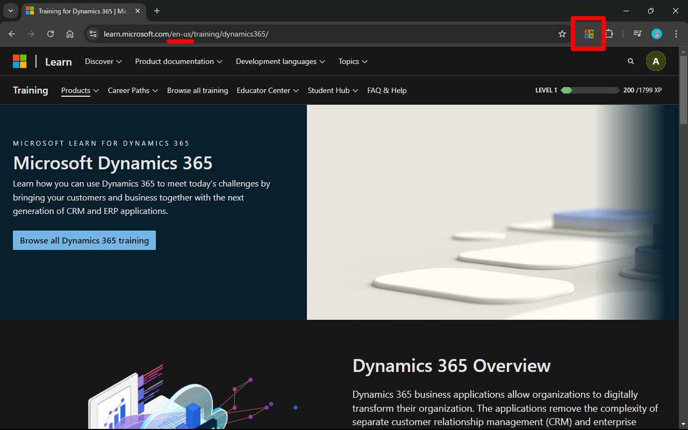

# Microsoft Docs Locale Switcher

Microsoft Docs Locale Switcher is a simple Chrome extension that allows you to switch between `ja-jp` and `en-us` locales for Microsoft documentation with a single click.

## Features

- Switch the locale of Microsoft documentation URLs between `ja-jp` and `en-us`.
- Only activates on `microsoft.com` domain.
- Simple and lightweight.

## Installation

1. Install from [here](https://chromewebstore.google.com/detail/microsoft-docs-locale-swi/bdlfmipdlfjaecgakeffhgglpmmbicfp).

## Usage

1. Navigate to a Microsoft documentation page in Japanese or English.
2. Click the extension icon in the Chrome toolbar.
3. The page will reload with the locale switched between `ja-jp` and `en-us`.

 
